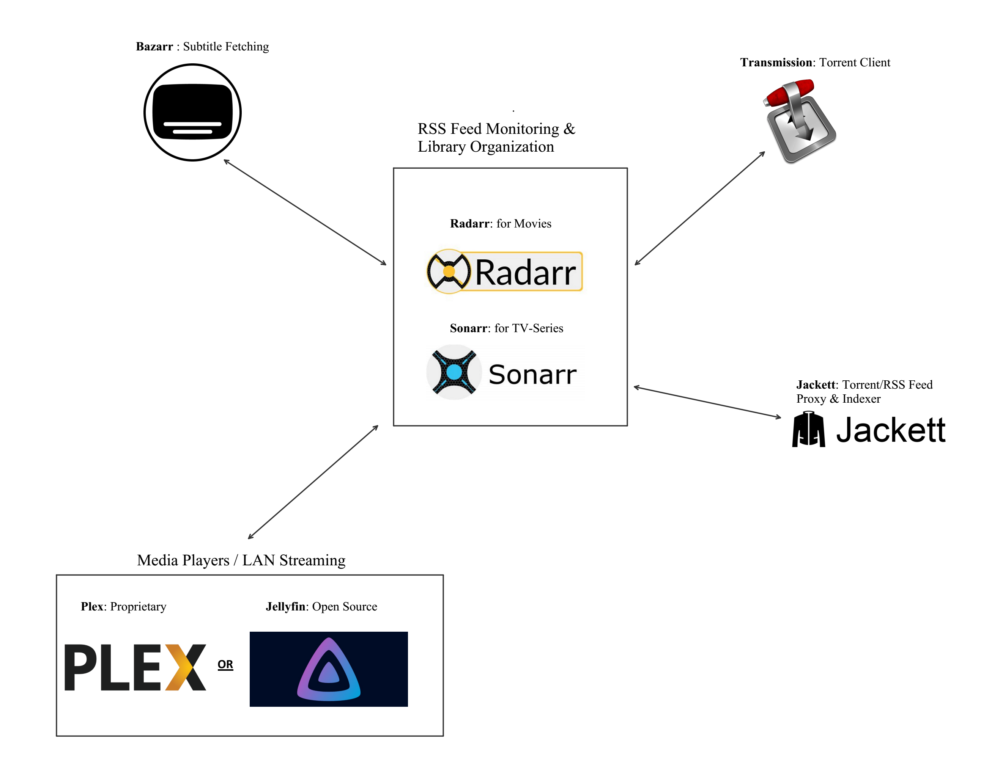

# Home Mediacenter
This is my home mediacenter stack using Docker containers and Docker-Compose for easy deployment. It was first developed in 2020 for personal use. 


Table of Contents
=================

* [Architecture](#architecture)
* [Deployment](#deployment)
* [Updating the containers](#updating-the-containers)
* [Security Considerations](#security-considerations)


## Architecture
The stack is built using the following **open source** projects:


| Name | Brief Description | WebUI Default Port |
|---|---|---|
| [Sonarr](https://sonarr.tv/) | RSS Feed Monitoring & Library Organizer for Series. | 8989 |
| [Radarr](https://radarr.video/) | RSS Feed Monitoring & Library Organizer for Movies. | 7878 |
| [Jackett](https://github.com/Jackett/Jackett) | RSS/Torrent feed proxy with wide provider support. | 9117 |
| [Transmission](https://transmissionbt.com/) | BitTorrent Client with WebUI. | 9091 |
| [Bazarr](https://www.bazarr.media/) | Subtitle downloader compatible with Sonarr & Radarr. | 6767 |
| [Jellyfin](https://jellyfin.org/) | Media Player / Streamer | 8096 |

<u>NOTE</u>: [Plex](https://www.plex.tv/) can be used as an alternative media player/streamer, if features such as network/DLNA discovery are needed. Although Jellyfin is preferred, because of its Open Source nature, and the fact that it does not require the "host" networking driver.

A high level view of how all those services communicate with each other is shown below:




## Deployment
This stack is build to be deployed using docker-compose. 

The main configuration file is purposely built using **environment variables** in order to be more modular.

These environment variables can be read during runtime from a local ".env" file. 

I have provided a [template file](.env.template) as well as a [script](build-env.sh) that parses that file and generates a proper ".env" file in the project directory, evaluating any nested variables that appear inside the template, because the docker-compose parser can't do that for now. Make sure to run the script while inside the repository's base directory, and that no other .env file exists in it.

The final yaml configuration file can be audited using:
```bash
chmod +x ./build-env.sh
./build-env.sh
docker-compose config
```
Then the whole stack can be deployed simply using
```bash
docker-compose up -d
```

I have also provided [another docker-compose file](misc/docker-compose-plex.yml) using Plex as the media player.

<u>IMPORTANT NOTE</u>: When first deployed, each service *has to be configured* according to user preferences **through it's Web-UI**. The configuration then **persists**, since the config directories are mounted directories of the host.

## Updating the containers
The update process for the whole stack is really simple. Using docker-compose all that needs to be done to update all the containers to their newest build is:
```bash
# Starting at the base repository directory
docker-compose pull
docker image prune --force
docker-compose up -d
```

## Security Considerations
- Memory and CPU limits were set as sane defaults in all 
  containers except the media player one (Jellyfin or Plex) which should be adjusted according to your streaming needs and hardware.

- User ID and Group ID for the dummy user that has access to the exposed filesystem can be set in the .env.template file. In order to create a user and group that has a specific ID the following commands should be run:
```bash
# Add group named "mediagroup" with GID 1234
sudo addgroup --gid 1234 mediagroup

# Then add normal user named "mediauser" with UID 1234 (you can skip --disabled-password 
# if you would like to set a password for the dummy user)
sudo adduser --shell /bin/bash --no-create-home --uid 1234 --gid 1234 --gecos "Mediacenter Dummy User,,," --disabled-password mediauser
```

- The "transmission" service's USER & PASS envionment variables (Web UI credentials) should be set using a Docker secret, but were included in the [.env.template](.env.template) file for reference.


## Authors

* **<a href="https://github.com/makariosb" target="_blank">`Makarios Christakis`</a>.** - *Initial work* 
